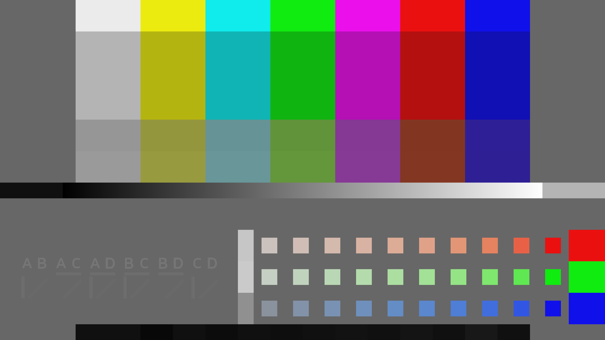
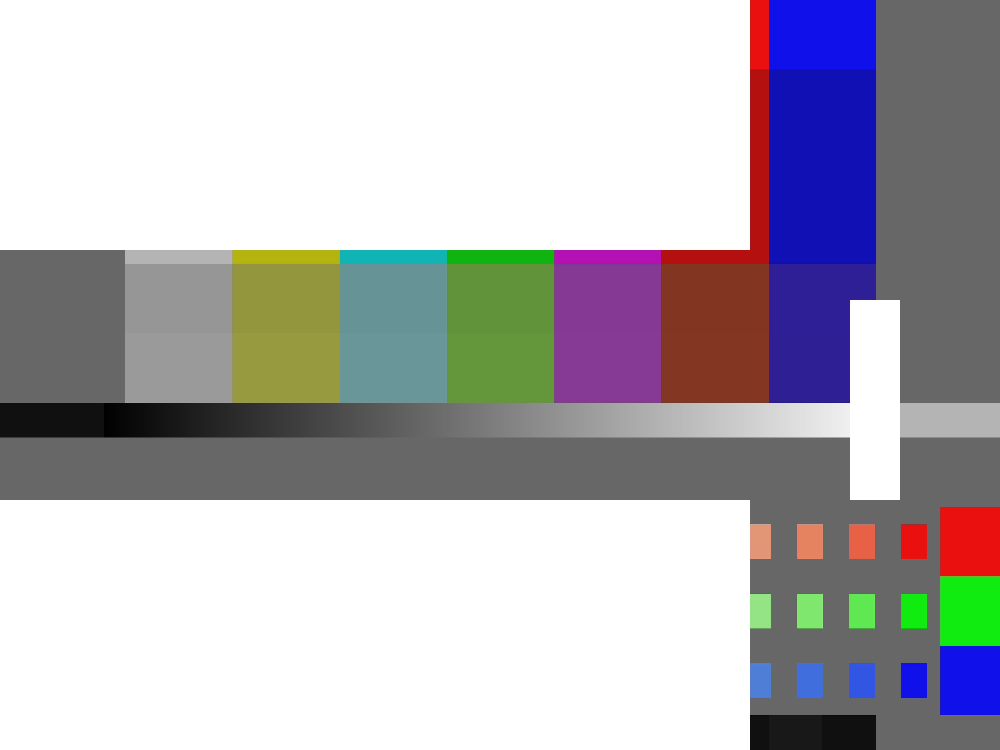
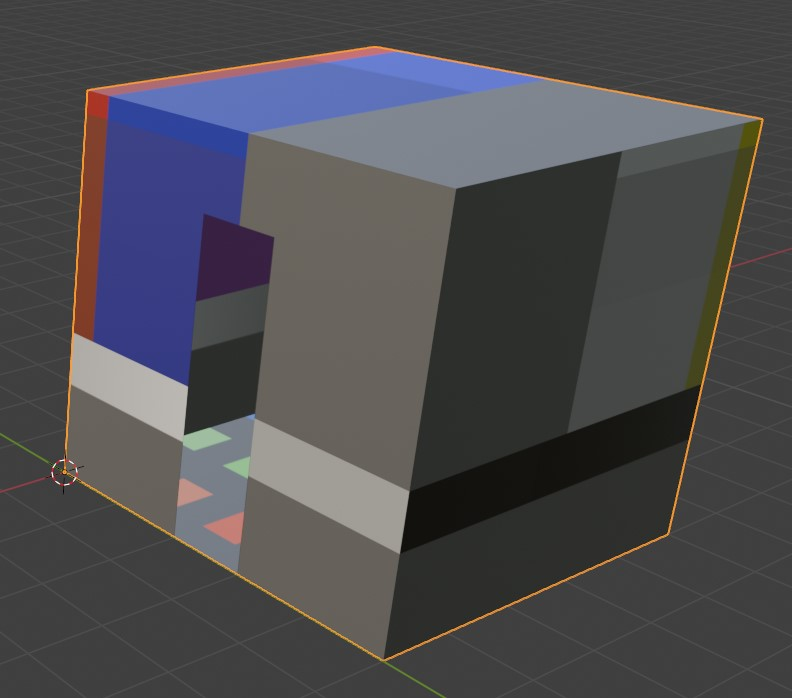

# TSIG Demo

TSIG stands for Test Signal Input Geometry. It is used for mapping flat images to 3d displays.

This demo will walk you through generating a pattern for a 2d display, and then for a 3d object that requires a TSIG file.

The demo has the following contents:

- [Pre Requisites](#pre-requisites)
- [How do TSIGs work](#how-do-tsigs-work)
- [Running the demo](#demo)
- [TSIG technical info](#tsig-technical-information)

## Pre requisites

In order to get the most out of this demo and to make
sure it runs as intended, please make sure you have done the following.

- Installed / Built openTSG
- You have read the documentation and are familiar with OpenTSG

## How do TSIGs work

A TSIG  (test pattern input geometry) file tells OpenTSG how to map a 3d object into a 2d image, so the image can then be displayed on the 3d display. This works by flattening the object into a base test pattern layout using the TSIG, then running openTSG with that base test pattern. The base test pattern can then be applied to the 3d display.

## Demo

This demo runs OpenTSG, generating the ebu3373 test pattern, for the TSIG geometry of a simple house and a standard 2d image.
You will get out two images, the first is ebu3373 which will be found at`./tsig/example/ebu3373.png`, then the
TSIG version which will be found at `./tsig/example/ebuHouse.png`.

Please make sure you have followed the installation instructions in the README, and that OpenTSG is running, before starting the demo

All output from the demo will be saved in the  `tsig/example` folder.

To generate the flat 2d image witn **no** geometry run  `./opentsg-node --c tsig/loadergrid.json --log stdout --debug`.
This generates the OpenTPG ebu3373 chart, as a flat test pattern.

The output should look like



To generate a  TSIG for the house geometry  run `./opentsg-node --c tsig/loaderTSIG.json --log stdout --debug`. This now uses a canvas file that has TSIG geometry.

The only difference between this and the previous input json is

the first input json (`tsig/gridexample.json`) had

```json
"canvas":{}
```

which has been updated to.

```json
"canvas":{    
    "name": [
      "./tsig/example/ebuHouse.png"
      ],
    "geometry":"./objBases/house.json"
  }
```

Which has now added the geometry field into the canvas options file (`tsig/base.json`)
for openTSG to use. (And the file name to avoid clashes)

The output should look like



Try visualising the test pattern geometry with Blender ( or other services ).
Using the house obj at `tsig/objBases/house.obj` and the generated image  you made at `tsig/example/out.png`.

It will look something like



Congratulations! You made your first test pattern for a 3d object 🎉

### Next steps

Try running it with more TSIGs (Yet to be added)

## TSIG Technical information

The size of the TSIG canvas supersedes the base canvas size in the json,
which is why the demo produces two sized different images (the TSIG image should be bigger).

Find about more about how TSIGs work
check the opentsg-core [TSIG docs](https://github.com/mrmxf/opentsg-modules/blob/main/opentsg-core/_docs/gridgen/doc.md)

To build your own TSIGs see the technical documentation [here](https://github.com/mrmxf/opentsg-modules/blob/main/opentsg-core/_docs/gridgen/doc.md)

### Widgets Built for TSIGs

Some widgets are built for geometric patterns in mind.
When these are used without a TSIG, the standard grid layout
of OpenTSG is used as the default to allow the widget to run.

The complete list of TSIG widgets is given below.

- [Four colour](https://github.com/mrmxf/opentsg-modules/blob/main/opentsg-widgets/_docs/fourcolour/doc.md)

