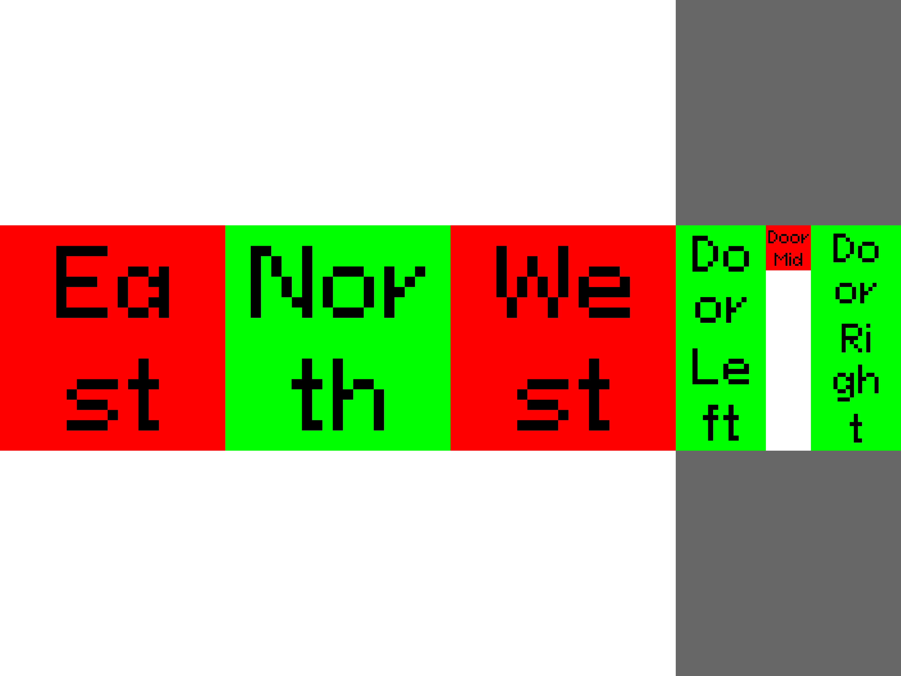
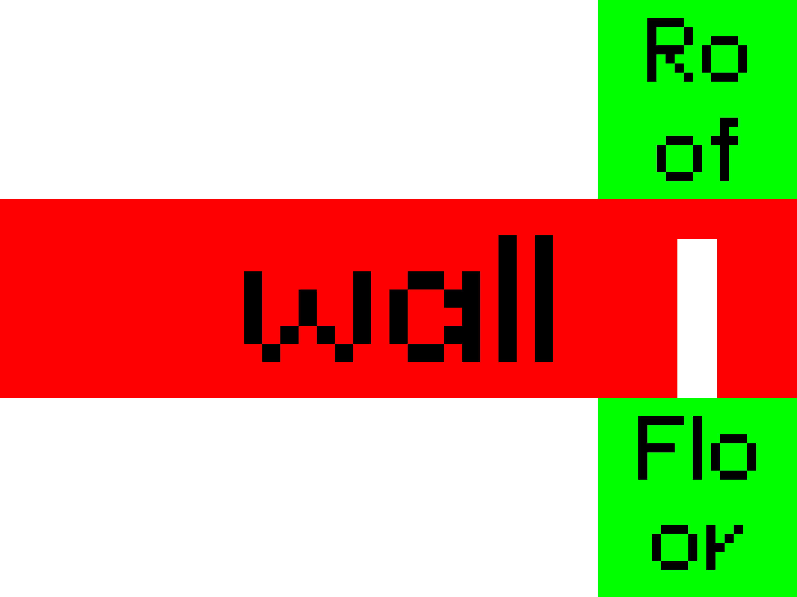

# House TSIG demo

TSIG stands for Test Signal Input Geometry. It is used for mapping flat images to 3d displays.

In this tutorial we will walk you through generating a pattern for a 2D display, where the properties of the TSIG are used to
generate the widget patches. This is following on from the previous four colour demos.
We will also go over grouping TSIG tiles, and generating widget patches based on TSIG groups and IDs.

Starting with groups and TSIGS, if we open the `house.json` file and look at the tiles you can see every tile has a groups field,
denoting what structure it is part of in the house. We can also utilise these groups to combine TSIGs to build new layouts from the same input json.
An example json is given below.

```json
"groups": {
    "structure": "Floor"
}
```

First we set up the canvas widget to render the frame.
We will be only running the four algorithm on the wall groups of the TSIG, the roof and floor
will not be drawn on.

To do this we use the `"useGridKeys"` field of the box and use the grid key of `"tsig:structure.wall"`, this key
specifies to search the TSIG, for all groups that have the `structure` field that have the `wall` property.

```python

from tsg import Tsg

title = "t12-gridKey"

paramsTsdef = {"name": title,  "folderPath": "tsg.out/" + title}
tsdef = Tsg(paramsTsdef)


pCanvas = {
    "type": "builtin.canvasoptions",
    "name": [title+"{{framenumber}}.png"],
    "geometry":"./house.json"
}
tsdef.main.addNew("w-canvas", "builtin.canvasoptions", pCanvas)

```

Now lets add the fourcolour algorithm to our canvas. Specifying the
`useGridKeys` field to only run on the walls. With the key `"tsig:structure.wall"`

```python
pFourColor = {
    # Use the useGridKeys to specify what groups
    "props":{"location":{"box": {"useGridKeys": ["tsig:structure.wall"]}}},
    # Choose a minimum of four colours
    # We go for red, green, blue and yellow
    "colors": [ 
        "#FF0000",
        "#00FF00",
        "#0000FF",
        "#FFFF00"
    ]
}
tsdef.main.addNew("w-FourColor", "builtin.fourcolor", pFourColor)
```

Now lets label the TSIGs on our canvas, so we know which tile is which on the image.
To do this we use the GeometryText widget, that labels each TSIG tile given to it,
with its ID.
We will only label the wall widgets as they are the only
TSIGs we coloured in.
WE do this, by repeating the location we used for the four colour widget.

```python

pFourText = {
    "props":{"location": {"box": {"useGridKeys": ["tsig:structure.wall"]}}},
    # Choose the text colour
    "textColor": #000000
}
tsdef.main.addNew("w-GeomColor", "builtin.geometrytext", pFourText)
```

Now we have a simple testcard with a four colour widget and labels, lets run it to view our house tsig.

```python
tsdef.write(silent=False).render()
```

It should look like so.



Look how only the walls have been labelled and filled in, the other parts have been left as test card grey.

Now we repeat it all, but with rendering the TSIG by their structure group (roof, wall, floor).
Where the structure are grouped together into one TSIG tile, instead of the tiles that cover that group.

We start with the canvas again

```python

from tsg import Tsg

title = "t12-group-house"

paramsTsdef = {"name": title,  "folderPath": "tsg.out/" + title}
tsdef = Tsg(paramsTsdef)

# define the canvas widget on which we will render the frame
# Note the geometry field declaring the TSIG file,
# this supercedes the "frameSize" field we used on earlier tutorials
pCanvas = {
    "type": "builtin.canvasoptions",
    "name": [title+"{{framenumber}}.png"],
	"geometry":"../exampleTSIGs/house.json"
}
tsdef.main.addNew("w-canvas", "builtin.canvasoptions", pCanvas)
```

Now we move onto the fourcolour widget, where we add a new field of
`"TSIG"` to the widget properties. This field indicates any TSIG handling for the widget,
we use the `"grouping"` field to group the TSIG tiles and for this demo we will
be grouping them by `"structure"`.

```python
pFourColor = {
    "props":{"location":            {"box": {"x": 0, "y": 0, "width" : "100%", "height":"100%"}},
    "TSIG": {
            "grouping": "structure"
          }
    },
	# Choose a minimum of four colours
	# We go for red, green, blue and yellow
    "colors": [ 
        "#FF0000",
        "#00FF00",
        "#0000FF",
        "#FFFF00"
    ]
}
tsdef.main.addNew("w-FourColor", "builtin.fourcolor", pFourColor)
```

Now lets repeat the process for the labels, so we can visualise
the new TSIG groupings. We will be labelling the TSIGs by their new structure
groups.

```python
pFourText = {
    "props":{"location":            {"box": {"x": 0, "y": 0, "width" : "100%", "height":"100%"}},
    "TSIG": {
            "grouping": "structure"
          }
    },
	# Black text colour
    "textColor": #000000
}
tsdef.main.addNew("w-GeomColor", "builtin.geometrytext", pFourText)

```

Now lets run our test card

```python
tsdef.write(silent=False).render()
```



Compare this to the previous image, see how the walls are now labelled as one wall,
instead of their individual components.
Try running it again, but this time run the label without the grouping, how does the
output change?
